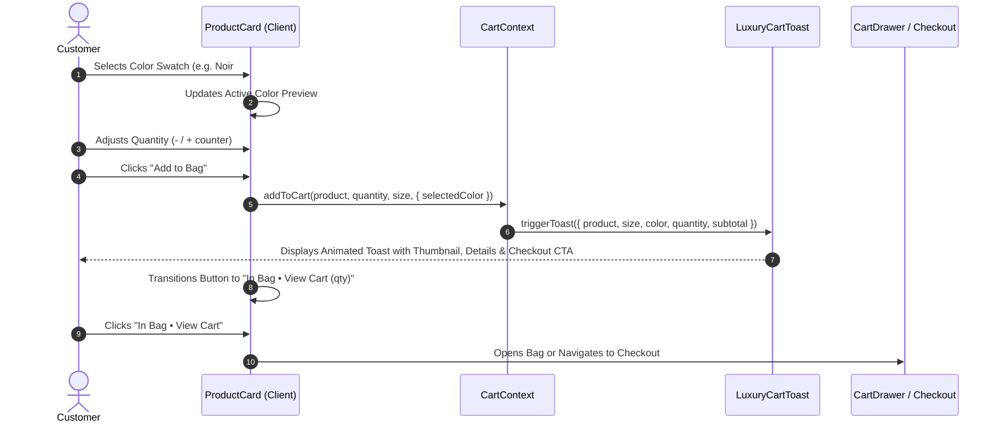

# System Architecture Brainstorm & E-Commerce Vision

## 1. Storefront Experience & Brand Philosophy
The platform embodies **quiet luxury minimalism**: high contrast monochrome palette (`#09090B` deep onyx, `#FFFFFF` crisp white, `#F4F4F5` warm zinc), editorial typography (`Bodoni Moda` serif headings paired with `Jost` sans-serif), generous whitespace, and frictionless micro-interactions.

---

## 2. Dynamic Product & Cart Micro-Interaction Flow



---

## 3. Product Data Model & Variant Architecture

To maintain zero-migration resilience while giving administrators 100% control, each product stores its variant definitions within the database:

```typescript
interface ProductVariantOptions {
  // Color Swatch Definitions
  colors: Array<{
    name: string        // e.g. "Onyx Black", "Ivory Cream", "Camel Beige"
    hex: string         // e.g. "#09090B", "#FDFBF7", "#C19A6B"
    image?: string      // Optional variant-specific lookbook photo
  }>
  // Collection Status
  isPastCollection: boolean // If true, categorized under Past Collections / Archive
  season?: string           // e.g. "Autumn/Winter 2024", "The Monolith Capsule"
  // Luxury Craftsmanship
  fabric?: {
    composition: string     // e.g. "100% Loro Piana Mongolian Cashmere"
    weight?: string         // e.g. "420 GSM Heavyweight"
    care: string            // e.g. "Dry Clean Only. Steam Iron with Cloth."
    origin?: string         // e.g. "Milled in Biella, Italy"
  }
}
```

This is stored in `customizationOptions` (JSON column in PostgreSQL) and queried seamlessly across `/api/products`.

---

## 4. Storefront Information Architecture

```
                      [Global Header]
           (Women | Men | Past Collections | Track Order)
                             │
     ┌───────────────────────┼────────────────────────┐
     ▼                       ▼                        ▼
[Homepage /]             [Portals]           [Archival Vault]
- Hero Lookbook          - /women            - /collections/past
- Curated Gateways       - /men              - Iconic Heritage Pieces
- Interactive Feed       - Faceted Filters   - Archival Storytelling
- Past Collections       (Sizes, Colors,
  Capsule Feature         Categories, Price)
```

---

## 5. Security & Threat Model (OWASP Top 10)
- **A01: Broken Access Control**: Strict role verification on all admin product write operations (`POST /api/products`, `PUT /api/products/:id`, `DELETE /api/products/:id`).
- **A03: Injection**: Parameterized SQL queries via Prisma ORM for all variant queries.
- **A05: Security Misconfiguration**: Helmet HTTP response headers, CORS domain whitelisting, and strict CSP.
